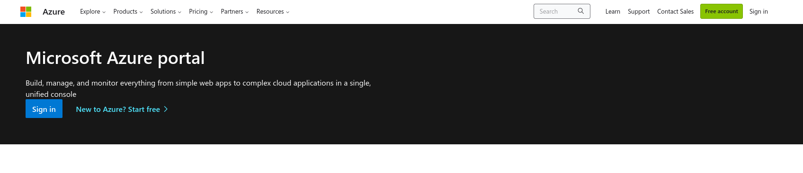
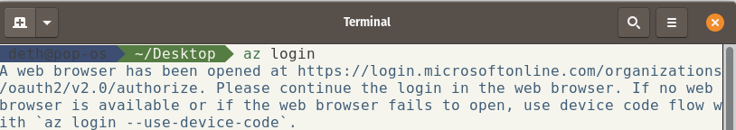

# MSPC: Bringing Your Own Data

Unlike all of the other documentation for the MSPC,
documentation for 'bringing' your own data is scant to nonexistent.
This is probably because this is not necessarily the intended use of the MSPC.
That said, it is an entirely possible and valid one, and it can make a lot of sense
because:

1. you may not have any other equivalent cloud infrastructure (where you can drop in and immediately start using the full Python and R geostacks) on hand;
2. you can use MSPC as a testing and code-development environment for your analysis;
3. then you could either decide to use MSPC for your entire full analysis (it's free, and well built!) or decide to stand up your own compute (where your code could be moved/cloned and then should run more or less as is).

This was my logic when I decided to use MSPC for a project, but I had a lot of trouble figuring out a workflow for setting up and accessing my data, none of which is included within the MSPC Data Catalog.

Thus, I document herein the steps I took. As a fair warning, they may not be the optimal steps, and some could be unnecessary or even flat-out wrong. However, they appear to have worked for me, so I write them up in the hopes that will save some other poor soul some time and sweat.

So, here goes!

## I. set up cloud storage

Your data will need to live in [Azure cloud blob storage](https://azure.microsoft.com/en-us/products/storage/blobs) (and specifically in the 'westeurope' region, where the MSPC computing is located). (Note: blob comes from BLOB, or 'Binary Large OBject' – unstructured storage for data in binary format. It is stored in data lakes, and... aaaand that's pretty much the edge of my understanding, so chances are you'll be fine stopping there too! 😅)

Thus, you will first need to set up a storage account and container. Here's a basic walkthrough of the process – or at least, the way I did the process, which was to default to scripting things (for reproducibility's sake) but not to be dogmatic about it. Because of that approach, most of the steps below present either images and/or code snippets.


### 1. Azure account creation
If you don't already have an Azure account then you'll need to create one [here](https://azure.microsoft.com/en-us/get-started/azure-portal) (should be straightforward).



### 2. Install the Azure CLI
Install the Azure Command Line Interface (CLI) to allow you to run commands from your local terminal. (Again, this is ideal from the point of view of
reproducibility, because you can figure out your exact step as a line of code, save it,
and then retrace your steps and/or redo them later on, if necessary...
such as I had to do in order to write up these notes!)
The installation will vary from one machine/OS to another, so the best I can do for is
to point you to [this link](https://learn.microsoft.com/en-us/cli/azure/install-azure-cli)
and ask you to follow the instructions.

The next handful of steps I followed were basically those laid out [here](https://learn.microsoft.com/en-us/azure/storage/common/storage-account-create?tabs=azure-cli), and they included:


### 3. Log into your Azure account from the CLI

This is very straightforward: You'll just run the command `az login` from your local terminal/console.

[ASIDE: I recognize that this may not be straightforward if you're not used to using a terminal! If that is the case, here are two tips to get you set up:
1. Open whichever program you typically use to search for other programs on your computer and search for it (look for "command prompt" on Windows; look for "Terminal" on Mac or Linux), then click on the program to open it.
2. To run a command in the prompt, you just first type it out (exactly as you see it! including spaces, dashes, underscores, and copying capital/lowercase letters correctly), then hit <Enter>.
3. When you use a terminal/console, if you do work that creates files/folders/etc they will be created inside whatever folder you are running your terminal/console from. This is likely to be either your "Home" or "Desktop" directory, but you can change it by running `cd </YOUR/PATH/HERE/>` (where you would replace `/YOUR/PATH/HERE/` with, well, your desired path. Note that how to format paths is outside the scope of this documentation, but there is plenty of good information on the web and it is a very good skill to have!).]

Okay, so, you've opened your terminal and run `az login`. You should first see the terminal telling you that it's sending you to a browser window to complete the login: 

Then your default browser should open a tab/window prompting you to log into your Azure account. This will look different depending on your institution/etc, but you would use the same login credentials that you created in step 1 (if you didn't already have an account).

Once you've successfully logged in, your terminal should register that, and then you should be good to go!


### 4. Create a new Azure resource group

This is where you can really begin to make valuable use the command line tool you've now set up.
The huge value-add here is that if anything goes wrong (e.g., you change your mind
about configurations, naming, storage types, etc.) you can just tweak
and rerun your scripts. You can also trace your steps and have a record
of what exactly you set up (which is especially helpful if, like me,
you find the cloud-service browser portals to be hectic and overwhelming to look at).

Again following [these instructions](https://learn.microsoft.com/en-us/azure/storage/common/storage-account-create?tabs=azure-cli),
you can create a new Azure resource group using the command:

```bash
az group create \
    --name <RES_GRP_NAME> \
    --location westeurope      # must be colocated w/ mspc compute in westeurope
```

A few important notes:
- As in examples above and below, you need to replace variables formatted as
`<CAPITAL_LETTERS>` with your preferred variable names (e.g., in this case you could replace `<RES_GRP_NAME>` with `my_mspc_res_grp`).
- When you *do* replace that variables, you'll have the easiest go of it if you *only lowercase letters, numbers, and dashes*, because certain variables in Azure require that.
- Lastly, since I mentioned undoing mistakes or changing your mind, here's how
you could delete a resource group: `az group delete --resource-group <RES_GRP_NAME>`. (There are of course similar commands to delete other Azure infrastructural components; if I don't show any of them below then a simple Google search should find the Azure docs page that does the trick.)


### 5. Create a general-purpose Azure storage account

Having created your resource group, you can now create
a storage account within it by:

```bash
az storage account create \
    --name <STOR_ACCT_NAME> \          # only lowercase letters and numbers!
    --resource-group <RES_GRP_NAME> \  # same name from above!
    --location westeurope \            # for MSPC, always westeurope! 
    --sku Standard_RAGRS \             # needed, but I still don't know what it is...
    --kind StorageV2                   # we want standard blob storage!
```

## II. convert data to cloud-native formats

### 6. Gather your raw data

Nothing much to show here, but just a reminder:
gather and store all the raw data you want to work with.

A few best practices to consider:
- Have raw, untouched copies of all data, somewhere. (If you're downloading you data, then in a separate directory; if you're transferring your data more or less directly from an FTP server or the like, and you really trust the providing server to be dependable, then maybe not a big concern?)
- Store any important metadata with the data! (This includes the URL, data of access, metadata files from the provider, etc.)
- Again, with reproducibility as a core value (you'll thank yourself later!), consider writing and version-controlling code that downloads and transfers your raw data.

### 7. Convert your data

For the purposes of the rest of this walkthrough I will be assuming you are only working with
raster datasets. (That said, if you are working with vector data then you may
need to convert that geoparquet or some other format? This is not something I know
much about yet, so I won't go any further, but the web will help answer questions until
such time as I later update this, if ever...)

So, assuming you are working with raster data: You'll most likely be receiving data in
more traditional formats (e.g., GeoTIFF, NetCDF). The most straightforward way to
prep this for cloud-native analysis is to convert to
[Cloud Optimized Geotiff (COG)](https://www.cogeo.org/).
(I believe zarr is another option, but I have not worked with this, so will leave
that aside for now.)
COGs are a keystone piece of the emergent world of cloud-native geoprocessing.
I won't go into detail here, but a one sentence summary should give you enough insight
to know how and why they're used: A COG is formatted like a standard GeoTIFF,
but with an added, internal header that serves as a spatiotemporal index of
the file contents, allowing read operations with spatiotemporal constraints to stream out only the portion
of the file that satisfy those constraints, rather than loading the entire contents into memory.

Luckily, [GDAL](https://gdal.org/) now includes a [COG driver](https://gdal.org/drivers/raster/cog.html), so GDAL-based tools can be used to convert raster files in other formats to COGs.
The most convenient option I've found for this is the [rasterio](https://rasterio.readthedocs.io/en/stable/) command line interface (CLI).

(Note: Because you are reading this walkthrough, I am assuming that
you do a fair amount of geospatial analysis, and thus already have GDAL
and rasterio installed. If that is not case, now would be a good time to step
back, read up a bit on them, and then walk through the installation instructions.
GDAL is a very broad-purpose library that sits at the core of not just open-source
but also commercial GIS software; installation is thus not a one-size-fits-all procedure,
so you are best off running a web search, patiently reading through the results,
and deciding on a set of instructions to follow (though [conda](https://anaconda.org/conda-forge/gdal)
can be a good option).
Installing [rasterio](https://rasterio.readthedocs.io/en/stable/installation.html)
is pretty standard.
In both cases, installation is usually uneventful.
Yet, as goes for any install, the process and experience 
will vary across OS's and architectures in ways that I cannot go into here, and it
can lead to persnickety issues. That said, it is essential
that you have these tools installed if you wish to follow
the subsequent steps, and they are extremely useful tools that are
worth having and using at any rate. So, godspeed!)

Using the rasterio CLI (shortened to `rio`) to convert non-COG raters
to COGs looks like this:

```bash
rio cogeo create \
    -p lzw \                    # compression type; LZW seemed fine to me, but...?
    --blocksize <BLOCKSIZE> \   # tilesize for internal file division
    --nodata <NODATA_VAL> \     # masking value for missing data
    --add-mask \                # force output to use nodata value to create a mask
    -t <DTYPE> \                # datatype to use for output (e.g., int16, float64, ...)
    </PATH/TO/NON-COG> \        # file to be converted
    </OUTPUT/PATH/FOR/COG>      # path and filename of output COG file
```

While there is a number of arguments demonstrated there, not all are
strictly necessary.
At any rate, it is very worth your time to sit down and think through,
for each of your datasets,
the best values for each of those arguments.
Some thoughts to share:
- A call to `rio cogeo create --help` will explain all of the required and optional arguments.
- A call to [`gdalinfo </PATH/TO/NON-COG>`](https://gdal.org/programs/gdalinfo.html) can tell you the datatype and nodata value for your input non-COG raster file (assuming that metadata was dutifully recorded when the raster file was written; otherwise you may need to do some exploration of the file itself).
- The COG blocksize (a.k.a. tilesize) must be divisible by 16 (per the COG specification), but otherwise has no 'right' answer. I *believe* this number determines the minimum unit of the data that can be indexed out of your COG into your analysis, so a blocksize that is too large of a fraction of your overall filesize will probably nullify the value of even creating and using COGs in the first instance. I have also read somewhere that you will later, in your analysis code, want to tell dask to read arrays with a chunksize that is an exact multiple of your COG blocksize, so that could factor into your thinking here.
- Once again, your best bet is not to run these conversion commands one-off by typing them up each time, but instead to write up a script that methodically defines the argument values you desire and walks through and converts all of your data files. That code can then be changed, version-controlled, and reused as needed.


## III. index data with a [**STAC**](stac.md)

You now have a whole dataset (or set of datasets) converted to cloud-optimized
formats. You could at this point upload that data directly to your Azure storage,
and then begin using MSPC to read and work with the data.
That may be quicker, and preferable, if each raster dataset
you're working with consists of just a single file.
However, because raster data is heavy and is often split into tile files,
manually managing all those files, and manually reading and mosaicking segments of them,
could be real drag. This is way that the STAC specification
comes into its own: if you have all of those tile files
indexed with a STAC then a simple one-liner bit of code
could search the STAC and identify the set of files (i.e., 'assets',
in STAC lingo) you need to pull data from in order
to cover your time period and geographic bounding box of interest.

More generally, indexing your data with STAC will allow
some software packages/libraries to search the whole STAC not just
spatiotemporally but also on the basis of variable names, band names,
and metadata (e.g., cloud fraction),
and other packages/libraries can then stream data out of the identified
assets into your analysis as needed to compute your requested result.

(Note: In what follows I assume that you have a basic, working understanding
of the STAC specification. That means that, if you haven't already,
you may want to read through the [**STAC**](stac.md) page, and then
follow up with any of the external resources linked there.)


### 8. Index your data with a STAC 

A STAC consists of a nested set of files storing hierarchical sets of key-value pairs
in a human-readable format called [JSON](https://en.wikipedia.org/wiki/JSON#Syntax).
Thus, in theory, a STAC could be arduously typed up by hand.
However, in reality, there are only reasons not to do that
(not the least of which being the migraine you might induce
trying to meticulously curate all the curly braces).
The only reasonable way to build a STAC for your dataset, IMHO,
is to script it.

In my instance, I used Python and was able to do this for a large, complex dataset:

- a 500-tile global map with 4 bands
- a 260-tile global map with 2 variables
- a single-file global map with 3 variables
- a single-file global map with a single variable

The only new Python package you'll need for doing this is called
[`pystac`](https://pystac.readthedocs.io/en/stable/).
As with any new package, there is a learning curve, but I did not
find it to be particularly long or steep, especially after
reading up on the conceptual model and the core components of the STAC
index (again, see the [**STAC**](stac.md) page!).

There are only a few major object types, corresponding to those core STAC components.
`pystac` provides straightforward functions for creating
those objects and setting the values of their required
and optional fields,
and then provides a handful of methods (i.e., functions that
inhere to those objects) that allow you to organize
them into a STAC.
The STAC specification is flexible enough
to build catalogs with an arbitrary number of hierarchical
levels.
Thus, a STAC is essentially built by
'placing' the lower-level items
'into' their higher-level containers,
sequentially, up to the top level.
For my example, mentioned above, this produced a STAC with this basic structure
(and with words formatted in `Capitals` indicating the proper names of `pystac` object types):

- `Collection`:
  - sub-`Collection` 1 (global map of 500 tiles (i.e., `Item`s) and 4 bands (i.e.,`Asset`s))
    - `Item`: tile 1
      - `Asset`:  band 1
      - `Asset`:  band 2
      - `Asset`:  band 3
      - `Asset`:  band 4
    - `Item`: tile 2
      - `Asset`:  band 1
      - `Asset`:  band 2
      - `Asset`:  band 3
      - `Asset`:  band 4
    - ...
      - ...
      - ...
      - ...
      - ...
    - `Item`: tile 500
      - `Asset`:  band 1
      - `Asset`:  band 2
      - `Asset`:  band 3
      - `Asset`:  band 4
  - sub-`Collection` 2 (global map of 260 tiles and 2 variables (`Asset`s))
    - `Item`: tile 1
      - `Asset`:  var 1
      - `Asset`:  var 2
    - `Item`: tile 2
      - `Asset`:  var 1
      - `Asset`:  var 2
    - ...
      - ...
      - ...
      - ...
      - ...
    - `Item`: tile 260
      - `Asset`:  var 1
      - `Asset`:  var 2
  - sub-`Collection` 3 (global map of a single file and 3 variables)
    - `Item`: file 1
      - `Asset`:  var 1
      - `Asset`:  var 2
      - `Asset`:  var 3
  - sub-`Collection` 4 (global map of a single file and variable)
    - `Item`: file 1
      - `Asset`:  var 1

Seeing that STAC strucure laid out should go a long way toward helping you to plan out the structure of your own STAC.
If it seems simple and straightforward then that's because it really is!
(That said, it did take me a bit to figure out just how bands and variables and tiles
were all supposed to be related within different datasets and ultimatley within
the same STAC! It was only clear in hindsight.)

Now that we can clearly map out the target structure
of our STAC, the goal becomes one of writing code that walks our files,
gleans all their metadata (e.g., name, band/variable, tile number/position,
CRS information, timestamp, provider name, etc, etc, etc).
It's a lot of information, for sure, but gathering and recording it
is a methodical process.
I found that it was easiest to carefully gather some by hand
(e.g., provider name, dataset citations, etc.),
to gather some from the filename (e.g., the filename often indicates the variable or band
name as well as the year/timestamp and some indicator of the tile's bounding box),
and then to gather detailed CRS information by [opening files with `rasterio`](https://rasterio.readthedocs.io/en/stable/topics/reading.html) and then reading their attributes
(e.g., `opened_file.bounds`, `opened_file.crs.to_epsg`, `opened_file.transform`, `opened_file.shape`).

Putting that information-gathering together with the basic `psytac` functions,
what follows is a pseudo-script that demonstrates
and algorithm for constructing the STAC I've mapped out above.
(Note: Some details, such as how to store and/or determine
the metadata associated with each Asset, Item, and Collection are left for you to
work out, since they are fundamentally just data-management questions that are not
germane to learning how to build a STAC.)
(Note: The sections corresponding to the 4 levels of organization in the example STAC
outlined above (Collection, subCollection, Item, Asset) are set off in blocks of '#' and numbered, to aid comparison.)

```python
 # pystac imports
import pystac
from pystac.extensions.eo import EOExtension, Band
from pystac.extensions.projection import ProjectionExtension

# other imports
import datetime
import os


# lay out all datasets and their associated metadata
# NOTE: this mostly empty dict is a placeholder for however you
#       wish to articulate and organize that information
datasets = {'dataset_1': ...,
            'dataset_2': ...,
            'dataset_3': ...,
            'dataset_4': ...,
           }

# define the path string pointing to the main directory
# where you have all of your data files organized in a directory
# tree that mirrors the hierarchical structure of the STAC you're going to build
data_dir = ...

# define the URL string that points to the Azure container
# where your COGs will eventually be stored
azure_data_dir = ...


###############################################################################
# 1. MAKE COLLECTION

# define collection's spatial extent
min_lon = ...
max_lon = ...
min_lat = ...
max_lat = ...
spatial_extent = pystac.SpatialExtent([[min_lot, min_lat, max_lon, max_lat]])

# define collection's temporal extent
start_time = datetime.datetime(...)
end_time = datetime.datetime(...)
temporal_extent = pystac.TemporalExtent([[start_time, end_time]])

# define combined spatiotemporal extent
collection_extent = pystac.Extent(spatial_extent, temporal_extent)

# set collection title and description
collection_title = ...
collection_description = ...

# instantiate collection
collection = pystac.Collection(id=collection_id,
                               title=collection_title,
                               description=collection_description,
                               extent=collection_extent)

# define collection's data providers and license
collection.providers = ...
collection.license = ...


# loop and process datasets
for dataset, metadata in datasets.items():


    ###########################################################################
    # 2. MAKE SUBCOLLECTION

    # define id, title, description, extent, etc, as for overall collection
    # NOTE: could be pulled out of 'metadata'
    subcollection_id = ...
    subcollection_title = ...
    subcollection_descripton = ...
    subcollection_extent = ...
    subcollection = pystac.Collection(id=subcollection_id,
                                      title=subcollection_title,
                                      description=subcollection_description,
                                      extent=subcollection_extent)

    # get this dataset's vars
    # NOTE: could be pulled from the metadata, or otherwise determined
    vars = metadata[...]

    # loop over this dataset's tiles
    # NOTE: might be pulled from metadata, or otherwise determined
    tiles = metadata[...]
    for tile in tiles:


        #######################################################################
        # 3. MAKE ITEM

        # get geospatial metadata
        # NOTE: consider using `rio.open()` to read this from 1+ tile files;
        #       it is worth writing code to check that all files' geospatial
        #       metadata agrees perfectly; otherwise, you are likely to run
        #       into problems when you try to read in STAC Assets
        item_geometry = ...
        item_bbox = ...
        item_crs_epsg = ...
        item_crs_wkt = ...
        item_crs_transform = ...
        item_shape = ...

        # get item id, datetime
        item_id = ...
        item_datetime = ...

        # make the Item
        item = pystac.Item(id=item_id,
                           datetime=item_datetime,
                           geometry=item_geometry,
                           bbox=item_bbox,
                           properties={})

        # NOTE: you can use `ProjectionExtension` to add CRS info
        item_proj_extension = ProjectionExtension.ext(item, add_if_missing=True)
        item_proj_extension.epsg = item_crs_epsg
        item_proj_extension.wkt2 = item_crs_wkt
        item_proj_extension.transform = item_crs_transform
        item_proj_extension.shape = item_shape
        item_proj_extension.bbox = item.bbox

        # NOTE: you can use `EOExtension` to add band info
        item_eo_extension = EOExtension.ext(item, add_if_missing=True)
        item_eo_extension.bands = [Band.create(name=var) for var in vars]

        # loop over the variables
        for var in vars:

            # get COG filename
            # NOTE: may be determined from tile and var,
            #       indexed out of your metadata, etc;
            #       depends on your use case
            cog_file = ...

            # get the URL for the COG's location in Azure cloud storage
            cloud_cog_path = os.path.join(azure_data_dir, cog_file)


            ###################################################################
            # 4. MAKE ASSET

            # create the Asset
            # NOTE: see `[*pystac.MediaType]` for the list of MediaTypes
            asset = pystac.Asset(href=cloud_cog_path,
                                 media_type=pystac.MediaType.COG,
                                 roles=['data'],
                                 extra_fields={},
                                )

            # add the var as this Asset's band
            asset_eo_ext = EOExtension.ext(asset)
            asset_eo_ext.bands = [Band.create(name=var)]

            # add this Asset to the current Item
            item.add_asset(var, asset)

            ###################################################################

        # validate the Item
        item.validate()

        # add the Item to the current subCollection
        subcollection.add_item(item)

        #######################################################################

    # use the extents of all Items to reset the subCollection extent
    subcollection.update_extent_from_items()

    # add subcollection to overall collection
    collection.add_child(subcollection)

    ###############################################################################

# use the extents of all Items to reset the Collection extent
collection.update_extent_from_items()

# normalize all the Collection HREFs to the Azure cloud storage URL
collection.normalize_hrefs(root_href=azure_data_dir)

# set the Catalog type to ABSOLUTE_PUBLISHED and make all HREFs absolute
collection.catalog_type = getattr(pystac.CatalogType, catalog_type)
collection.make_all_asset_hrefs_absolute()

# crawl and validate all objects in the STAC
collection.validate_all()

# save the STAC
collection.save(data_dir)

###############################################################################                
```

And that's it! It's certainly not nothing, but it's a very organized process and
hopefully seems fairly straightforward. Now, with a bit of work, starting from this rough framework,
you can start developing a script for building a real STAC
to index your own data!

Some  notes on the final pieces of the workflow laid out above:
- There are three types of STAC Catalogs that can be made: `SELF_CONTAINED`, `RELATIVE_PUBLISHED`, and `ABSOLUTE_PUBLISHED`. I used `ABSOLUTE_PUBLISHED` in the pseudocode above, since we created fixed, absolute links to each Asset's file using our Azure cloud storage container URL. You can read about the types [here](https://pystac.readthedocs.io/en/latest/concepts.html#catalog-types).
- `pystac` includes functionality for running validation checks on a STAC. You'll see that called at the end (`collection.validate_all()`). Definitely don't forget this, to avoid pushing a broken STAC to the cloud and then running into confusing errors later on.
- The last line of code (`collection.save(...)`) will write the STAC to disk. This actually writes out a directory tree containing a suite of JSON files that, altogether, make up the full STAC.

And finally, before moving on to our last section, one closing thought: At this step, I was very confused for a while (and honestly, I still am!) about whether or not to create an API for my STAC.  I initially assumed I needed to do this because MSPC uses a STAC API to expose its Data Catalog to users.  However, I eventually found a simple way to read and search the STAC, and then read data out of it, without need for an API:

```python
import pystac                           # reads the STAC catalog
import stackstac                        # reads STAC Items/Assets into xarray objects
from shapely.geometry import Polygon    # a Polygon object for bbox searching

# define the Azure cloud storage URL to your highest-level STAC JSON file
catalog_url = ...

# define the name of the subcollection (i.e., dataset) you wish to read
subcollection_name = ...

# instantiate the pystac.Collection object by reading the STAC
catalog = pystac.Collection.from_file(href=catalog_url)

# define function for turning bounding box corners into a shapely.geometry.Polygon object
def make_bbox_poly(xmin, xmax, ymin, xmax):
    coords = [(xmin, ymin),
              (xmin, ymax),
              (xmax, ymax),
              (xmax, ymin),
              (xmin, ymin),
             ]
    return Polygon(coords)

# define the region of interest bounding box for the data you wish to stream in
roi = make_bbox_poly(...)

# get all items pertaining to the subcollection/dataset of interest,
# and subset items to only those intersecting your bounding box of interest
items = [i for i in catalog.get_child(subcollection_name).get_all_items() if
                make_bbox_poly(i.bbox).intersects(roi_poly)]

# read the items into a lazy xarray object
# NOTE: there are a number of arguments here that you'll want to carefully set
arr = stackstac.stack(items=pystac.ItemCollection(items),
                      ...,
                     )
```

It's a  bit sloppy, but it gets the job done!

Thus, the long and short answers to my concern:

- *long*: I still don't know if maybe there would have been benefits to investing the time to create my own STAC API, but I've never made an API before, and it felt daunting when I had other things pressing for my time, and in the end it wasn't actually necessary, so I opted not to.
- *short*: maybe nice; not necessary.

## IV. store data on Azure


This last step is a quick and simple one, but of course a crucial one!
You should now have, locally, a directory containing all of the subdirectories of
actual data files and all the subdirectories containing the STAC JSON files
that were created to index them.
Once you upload that whole setup to the cloud, you will
then be able to stream data out of it into an analysis,
just like you can stream MSPC Data Catalog data into an analysis.

You could of course just use the browser-based Azure storage portal to upload all of your files by point-and-click.
However, to avoid error, to record your steps, and for the sake of reproducibility,
scripting this would be ideal.
Luckily, this is pretty easy to do!


### 9. [OPTIONAL] Upgrade to a paid Azure account

If your experience goes the same as mine,
the Azure account you created above (or before)
could have been a free account that has since lapsed.
If that is the case, these quick steps should set your account up
as 'pay-as-you-go', with a valid payment method.

1. Log into the [Azure portal](https://portal.azure.com).
2. Search for 'Subscriptions' and select yours.
3. Click the upgrade banner at the top, or "Upgrade subscription" at the left.
4. Rename the subscription, if desired.
5. When asked, you can just select the 'Basic' account (i.e., billing and subscription management, but no tech support).
6. Click 'Upgrade'
7. Set up and verify your payment method, as instructed/needed.
8. It will then take a few minutes and/or a browser refresh before you see your account status updated (i.e., before your account is upgraded upgrade takes effect and the "Disabled" label changes to "Active").


### 10. Request a SAS token

Access to Azure cloud storage is mediated via Shared Access Signature (SAS) tokens.
These tokens are appended to the end of a URL that is used to request data from
a blob (Binary Large OBject, which is the type of storage your STAC and COGs will be kept in), authenticating the request and authorizing Azure to allow the data to be read.

The steps laid out below will get you set up to generate and use SAS tokens for your
storage. I do not have a lot of experience
using them, so I do not have much insight to share.
That said, the steps below got me what I needed:

1. Log into the [Azure portal](https://portal.azure.com).
2. Navigate to "Resource Groups" -> \<RES_GRP_NAME\> -> \<STOR_ACCT_NAME> -> "Shared Access Signature"
3. Check the checkboxes for all of the "Allowed Resource Types" that you want allowed for your storage (I chose all three of Service, Container, and Object, but I believe just Object would have been fine), then make sure that "Generate SAS and connection string" changed from faded to blue and clickable.
4. Adjust the start and expiry date/time as you see fit. (You can make your token expire in a minute, an hour, 8 hours, etc.)
5. Click "Generate SAS and connection string"
6. Click the 'copy' icon, to the right of the 'SAS token' section that appears further down the screen, to copy your new SAS token to your clipboard.

### 11. Install `azcopy`

Because this dead horse just isn't dead *enough*: Reproducibility is clutch, and scripting is the way to get it.
Thus, we want to use our local CLI to move our data into Azure cloud storage,
rather than pointing and clicking our way there. (What if we need to replace our data?
And then we realized we screwed up and need to replace it again? The time spent
quickly adds up, and you'll soon surpass the time you would have invested in
just installing the right command line utility and writing a few lines of code with it.)

In this case, the right utility is called `azcopy`. As the name implies, it's a tool
for copying data to and from blob storage.

I wont' write much here, because you just need to run a successful, one-time install.
So, follow the instructions [here](https://learn.microsoft.com/en-us/azure/storage/common/storage-use-azcopy-v10)!


### 12. Create your storage container

You now have the CL tool you'll use to upload your data to blob storage, and the SAS token that will allow you to do it. The only thing you're still missing is a container to upload them *into*.
This is easy to take care of using `azcopy` as well!
Decide on a nice, clear name for your new container (`<CONT_NAME>`, below), then run:

```bash
azcopy make "https://<STOR_ACCT_NAME>.blob.core.windwos.net/<CONT_NAME><SAS_TOKEN>"
```

Note that your SAS token is appended right to the end of that URL
(and you can check that is should always start with a "?").
That is in fact the canonical way to use it to authenticate any URLs you use
to interact with your Azure storage account. You'll see that again in the following step.

At this stage, it is worth checking that that command worked by logging into the
Azure portal, navigating to your storage account, and checking that you now see
your new container name listed in the "Containers" section (which you can find and navigate to in the list down the left of the page).


### 13. Copy your data to blob storage

Finally! You have arrived at the last step! You are ready to copy the whole directory tree of COGs and STAC JSON files to your Azure blob storage.

Please note: You are going to upload a whole directory tree, which contain all of your hierearchically organized directories of data (i.e., COGs) and all of the hierarchically
organized directories of STAC JSON files that `pystac` created there as well. (And it should contain *only* those contents!) Thus, do make a final check that that is how you have your data all set up. If you do, then you should be able to write
a single path string that points the parent directory containing all of that.

With that path string in hand, you can go ahead and execute this last command,
recursively (i.e., all the way down through all subdirectories inside your parent directory)
uploading all of your data:

```bash
azcopy copy </PATH/TO/YOUR/TARGET/PARENT/DIRECTORY> \
    "https://<STOR_ACCT_NAME>.blob.core.windows.net/<CONT_NAME><SAS_TOKEN>" \
    --recursive=true \
    --overwrite=<OVERWRITE_DECISION>      
```

Note the last argument there: `--overwrite`. If you set that equal to `false`,
the command will not have permission to aggressively overwrite (or 'clobber')
files that already exist. That's the safest option.
However, if you happen to be troubleshooting this whole workflow and find a problem
in your STAC, or with your COGs, or what-have-you — a problem that
doesn't change the number or names of the files or directories, but just changes
their contents or characteristics — then setting it to `true` can save you the trouble
of running two separate commands, one to first delete the broken files, the next to upload
working ones.

At this point, you will again want to log into the Azure portal. Navigate this time
to your resource group -> your storage account -> your container.
Once you do, you should see some (if the command is still running) or all
(if it's completed) of your data now living in your storage.
Check that this is the case!


## Wrapping up

And that's that! You've made it through!
At this point, you should now have a fully functional STAC
setup living in the Azure cloud (and in the `westeurope` region,
where the MSPC also lives).

You are now, finally, ready to log into the [**MSPC Hub**](hub.md),
boot up a Python 3 Jupyter notebook, draft up some quick code
(see the pseudocode I provide at the bottom of step 10, as a starting
point, or any of the code in the MSPC Data Catalog's Example Notebooks),
and confirm that you are able to:

1. connect to your Azure blob storage;
2. authenticate with a SAS token;
3. read your STAC into a `pystac.Collection` object;
4.  provide an arbitrary spatiotemporal extent (one that at least partially overlaps that of your data, of course!);
5. use that extent to search your catalog and return a set of items;
6. read those items into a lazy `xarray` object using `stackstac`;
7. and finally, call a compute and/or plot comand on that object, which will request a result that will be computed on the fly as your data is streamed in.

If that all checks out then you are hopefully good to go!


