# The MSPC Hub:

The hub is built as a **PanGeo Cloud** environment in 
a **JupyterHub** instance. Let's take that apart, working backward:

According to the [PanGeo Cloud docs](https://us-central1-b.gcp.pangeo.io/hub/login?next=%2Fhub%2F), [**JupyterHub**](https://jupyter.org/hub) 
    "JupyterHub brings the power of notebooks to groups of users. It gives users access to computational environments and resources without burdening the users with installation and maintenance tasks. Users - including students, researchers, and data scientists - can get their work done in their own workspaces on shared resources which can be managed efficiently by system administrators."

[**PanGeo**](https://pangeo.io/index.html) is a community of folks who develop and provide
compute tools and a cloud-based compute workflow and environment for
big-data geocomputing.
This approach to geocomputing depends on a set of [core packages](https://pangeo.io/packages.html#packages)
that are also central to MSPC workflows
(mostly; I haven't found myself needing to use Iris at all, though...),
and thus are very worth taking the time to learn well.
(**Note**: Their documentation is excellent and, unlike most cloud computing documentation, it is built with scientists in mind rather than private industry!
I recommend starting with their 

The [**PanGeo Cloud**](https://pangeo.io/cloud.html) is a cloud-basd data-science environment
in which each user has a private, virtual environment (analogous to a user space on a bare-metal server like a campus supercomputer), called `/home/joyvan`, which is intended only for code, notes, small data, etc. (10 GB limit).
The compute environment is accessed through the browser, so you just log in there,
and you can up/download smaller objects/files directly to the home directory
(though you should defer to using [Git](https://git-scm.com/)/[GitHub](https://github.com/) as much as possible).
Data of any 'meaningful' size should not be stored in [Azure](https://azure.microsoft.com/en-us) cloud storage instead. (**Note**: they *must* be stored in the `westeurope` Azure region, so that are colocated with the MPSC servers.)

(FYI: Cloud storage is effectively a key-value system,
where keys are strings and values are bytes of data.
Data is read and written using HTTP calls.
Importantly, performance of object storage is very different
from file storage; according to the
[PanGeo docs](https://pangeo.io/cloud.html#cloud-object-storage):
    "On one hand, each individual read / write to object storage has a high overhead (10-100 ms), since it has to go over the network. On the other hand, object storage “scales out” nearly infinitely, meaning that we can make hundreds, thousands, or millions of concurrent reads / writes. This makes object storage well suited for distributed data analytics. However, the software architecture of a data analysis system must be adapted to take advantage of these properties. All large datasets (> 1 GB) in Pangeo Cloud should be stored in Cloud Object Storage."

# Interactive Jobs

The following will walk you stepwise through an interactive session in the Hub (with images):

1. Navigate to the [MSPC homepage](https://planetarycomputer.microsoft.com/). 

2. Click on the 'Hub' tab at top, choose the notebook server environment you wish to work in, then click the blue 'Start' button. (Note: the 'CPU - Python' option will use the Pangeo Notebook environment discussed above) 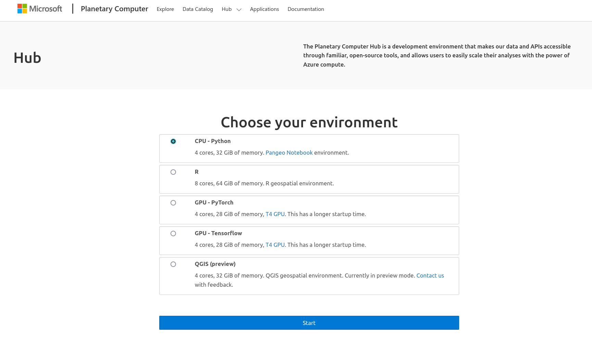

3. After some amount of time, your server will start up and you will be redirected to the a Jupyterhub instance with a landing-page README that you can use to practice/learn more. 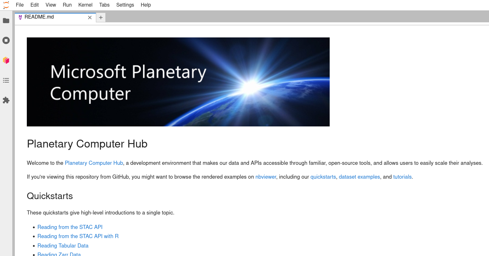

4. After closing that README tab, you should see a Launcher tab with a number of notebook, console, and other options. 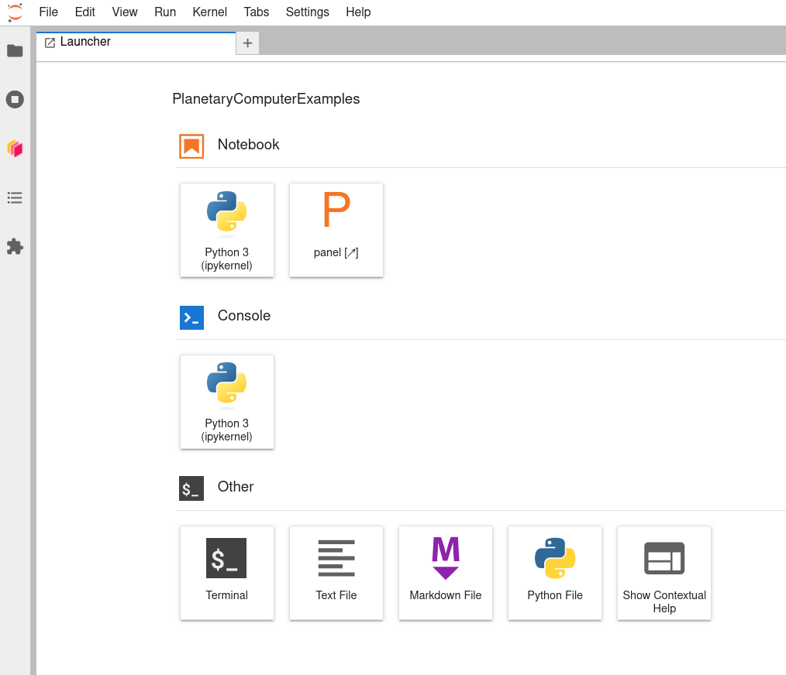

5. Before you start working in a notebook by clicking on a notebook logo within the Launcher, you may want to be sure you choose a working directory to work in. Use your mouse (or <Ctrl>-B) to open the bookmark tab at the left. 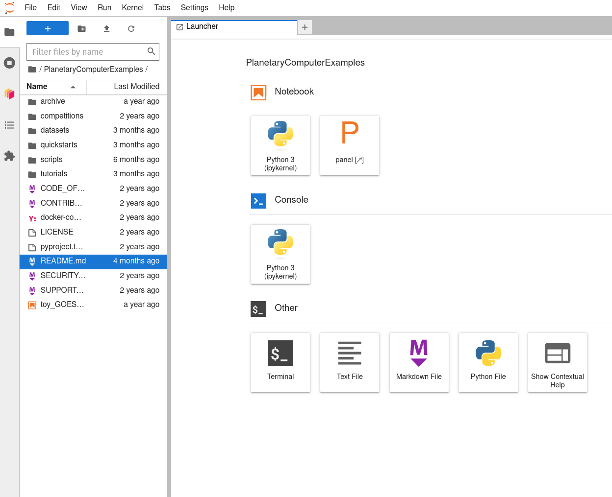

6. Navigate 'upward' through the directory tree by clicking on the parent directory's folder icon to the left of the current working directory's name (which should be "PlanetaryComputerExamples"). This will put you in your home directory on the Hub. Then click the new directory icon above (folder with a plus sign in it) and create and name a new directory (here, labeled 'my_MSPC_work'). 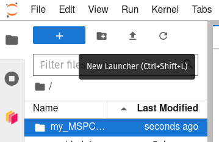

7. Double-click on that new folder to navigate 'downward' into it, then launch a Python 3 (ipykernel) notebook using the Launcher tab's icon. 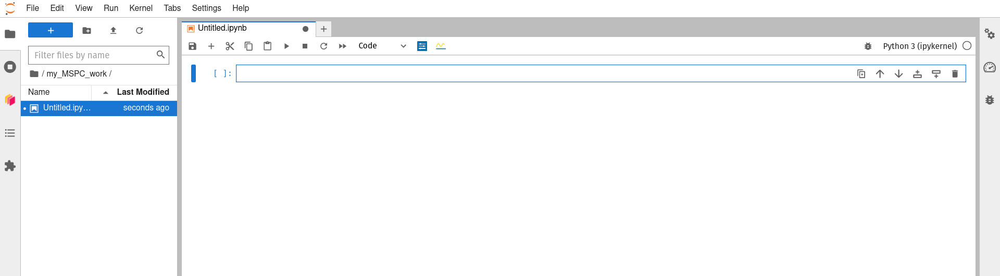

8. You can now use the Jupyter notebook interface as you may have before ([here](https://docs.jupyter.org/en/latest/) is a good starting point if this interface is new to you) to rename your notebook, do some work, and save your work as you go. Working in this new subdirecotry/folder that you created for yourself ('my_MSPC_work' in the example above) will allow you to save your work in a way that it is not wiped between sessions, and thus is still available). 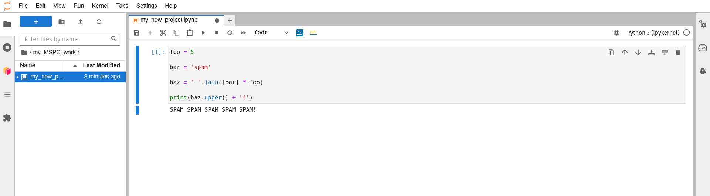

9. When finished working for now, don't forget to save your work, close your notebook (a Launcher tab will reappear to take its place), and then click File -> Hub Control Panel to get to the controls for your running server. 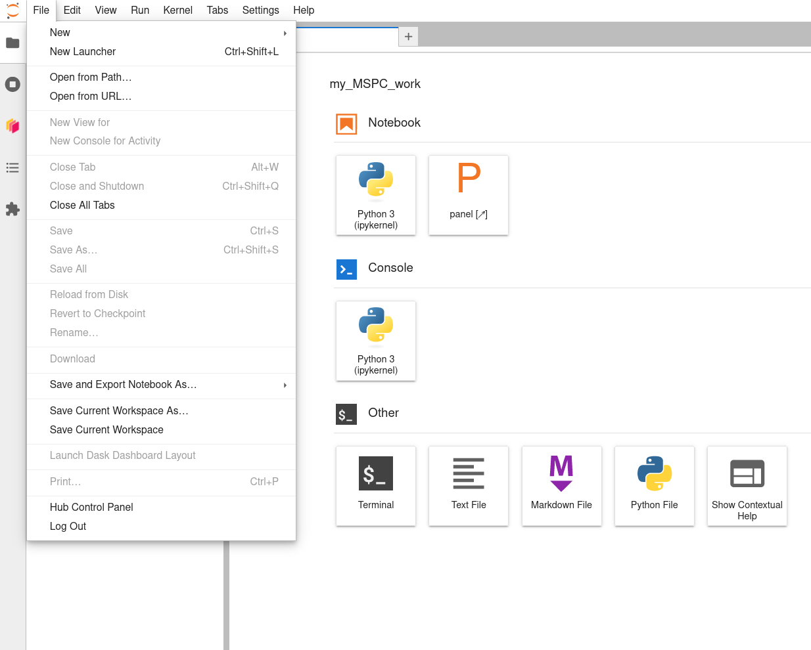

10. When you arrive at the Hub Control Panel page, double-click 'Stop My Server' to stop it from running' 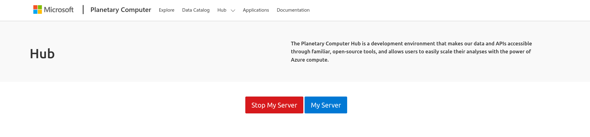

If you want to work with code that is version-controlled on GitHub (highly recommended!), then the following steps will get you set up:

1. In a new browser tab/window, visit the GitHub repository (or 'repo') that you want to clone (i.e., copy) the code of, click the green "<> Code" button, then click the copy icon next to the link that is displayed. 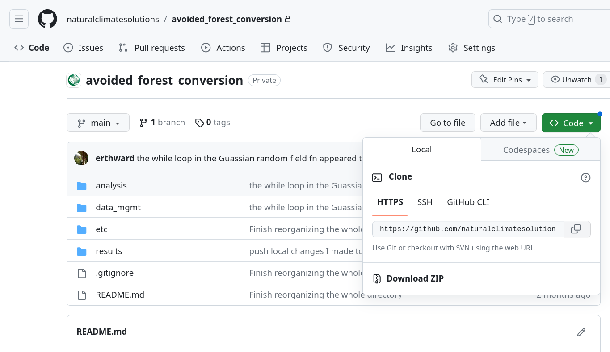

2. Back in the MSPC browser tab/window, use the Launcher tab to launch a bash terminal. 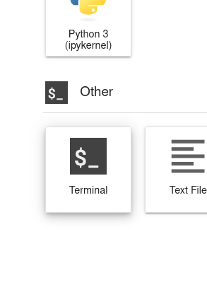

3. Call the bash `cd ~` command (i.e., type `cd ~` into the terminal's command line, then hit <Enter> to execute it) to make sure you have navigated to your home directory. 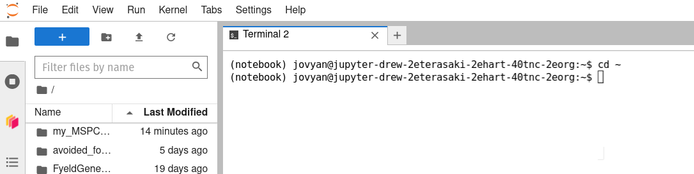

4. Type `git clone ` into the terminal, then use <Ctrl>-V to paste the GitHub repo's URL into the command line, then hit <Enter>. (Note: If you are attempting to clone a private GitHub repo to which you have access, you will be prompted to authenticate. Enter your username, press <Enter>, then enter your password (type carefully; for security purposes, no characters appear when passwords are typed into the command line), and press <Enter> again.) 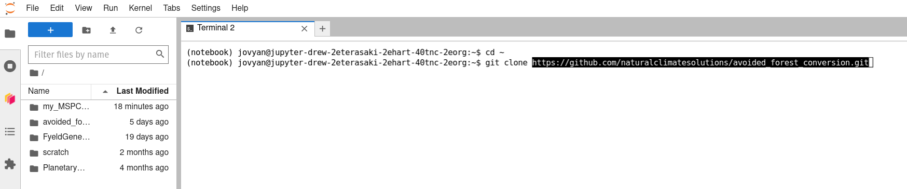

5. Once the command has finished running successfully (you will be returned to a new command line that is awaiting further input), you can click the terminal tab's 'x' to close it (a new Launcher tab will reappear in its place again), navigate into the newly cloned directory using the bookmarks tab at the left, and double-click on any Jupyter Noteook files (.ipynb extensions) or other files you wish to edit to begin working with them on the Hub. 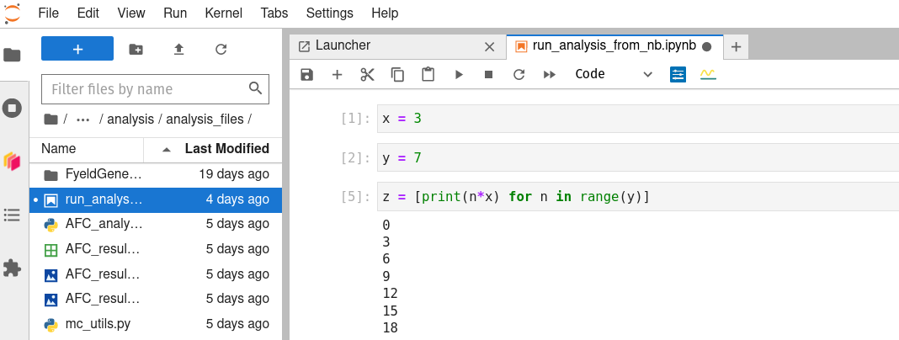

# Next steps:

## Dask:
[Dask](https://www.dask.org) is an important part of Pangeo Cloud, and thus of the MSPC Hub.
It is used to parallelize large calculations: i.e., to break them into small pieces,
run them all simultaneously on a 'cluster' of networked comuter nodes, or 'workers',
and then to combined all the sub-results into a final overall result at the end,
allowing for faster real-world, or 'wall-clock', runtimes than would be possible
if the whole job were run by one single, large computer.
This adds considerable to an overall compute task,
so it is really not worth doing unless
a standard, single-computer workflow is not well suited to your task.
If that is the case (e.g., it will take a prohibitively long time to run),
and if your job can be parallelized well (e.g., it can be thought of as doing identical
and independent computations on subsets of your overall dataset, such as running simple raster
algebra on raster tiles as a way of running the same computation on the very large composite raster), then Dask may be the key to achieving your goal.
In that case, please see the [**dask**](dask.md) page for more detail!

## Batch Jobs with `kbatch`:

On a standard cluster, such as a campus supercomputer, the last step
in a workflow may often be to submit a full, scaled-up analysis
as a batch job (which may take many hours or days to run to completion).
On the MSPC Hub, you can follow a roughly similar workflow,
using the `kbatch` command to submit batch jobs.
For more details, see the [**kbatch**](kbatch.md) page!

## Working with MSPC Data, Working with Your Data:

There are plenty of quick example workflows provided in the 'Example Notebook' tabs
under each of the datasets in the MSPC Data Catalog (e.g., [GBIF](https://planetarycomputer.microsoft.com/dataset/gbif#Example-Notebook)), and they can be opened interactively, run, and messed with in the Hub by clicking the blue 'Launch in Hub' button in the page.

MSPC also provides a number of examples that are a bit longer and more detailed, and that demonstate some key workflows, in the 'Quickstarts' section of [the documentation](https://planetarycomputer.microsoft.com/docs/overview/about).

If those workflows mirror your workflow close enough to get you started, and if you
want to work exclusively with data that is already in the MSPC Data Catalog,
then you might be ready to jump in an start building an analysis!

However, if you want to work with data that is not already in the MSPC Data Catalog then you'll need to do some manual interaction with Azure storage containers. Take a quick look at [this blob-storage example](https://planetarycomputer.microsoft.com/docs/quickstarts/storage/) to get a quick glimpse of how that could work, but then move on to my notes on [**using data not in the Data Catalog**](byo_data.md) for much more detail!

