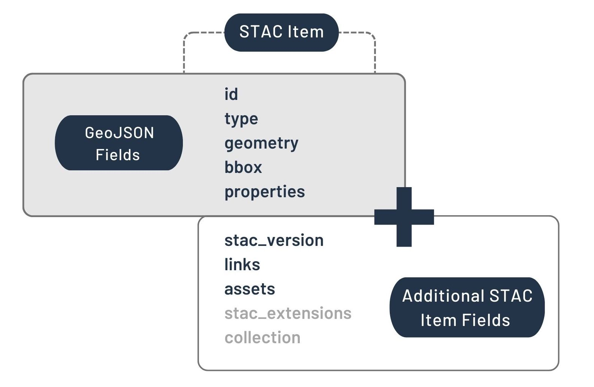
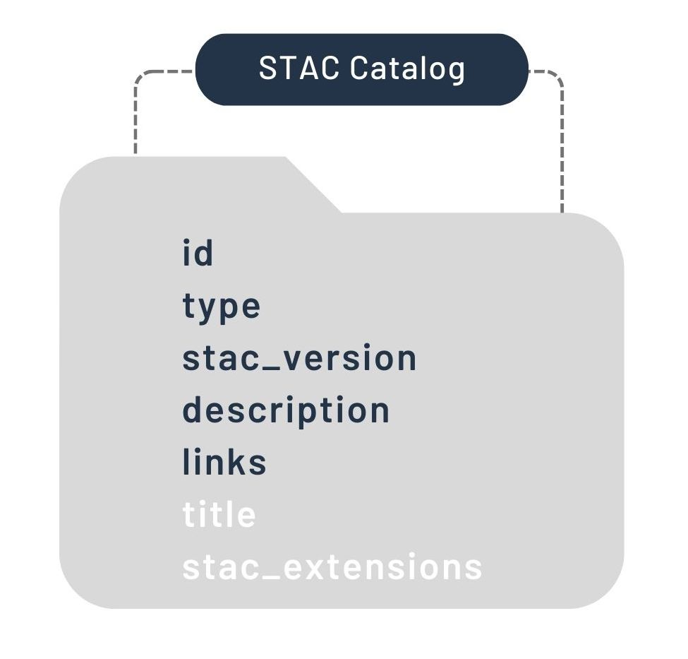

# Understanding STAC:

[STAC (SpatioTemporal Asset Catalog)](https://stacspec.org/en) is a specification
for a data structure that uses simple, human-readable
[JSON (JavaScript Object Notation)](https://www.json.org/json-en.html) files
to index a geospatial dataset's contents and their spatiotemporal (and other!) metadata
in a way that allows cloud-native analyses to search the index (e.g., "give me
all data within this bounding box and for this timeframe...") and
identify and read all data objects (or sections of data objects) that meet the search requirements.

Let's take that apart into two pieces (and visualize using the images provided by the [STAC website's intro tutorial](https://stacspec.org/en/tutorials/intro-to-stac/)):

## 1. the STAC format

The STAC specification has 3 core components that can be put together to
flexibly represent whatever geospatial dataset(s) you may want to throw at it.
(Note that the putting together of a STAC is a task that,
though it *could* be done 'by hand', is probably best scripted, 
and we walk through that process in the second main section of this page.)
The 3 core components are:

### Item:
An Item represents 1+ spatiotemporal Assets (i.e., actual files, containing information about Earth that is associated with a specific place and time) and makes their associated metadata (e.g., fields such as bounding box/geometry, time, cloud fraction, etc.) available for search.
It is the basic building block of a STAC, and its actual JSON fields are visualized by the STAC folks like this: .

### Catalog:
The Catalog provides a structure for grouping Items (or Collections; see below) together.
It can contain Items and/or other Catalogs or Collection, and thus provides STAC the flexibility to represent arbitrarily hierarchical datasets.
Its JSON fields look like this: 
and its potential components can be visualized like this: .

### Collection:
The Collection is really just a Catalog with some refinements. It extends the Catalog to provide additional metadata that applies to all items contained (e.g., overall spatial extent, data providers, data-use license, etc.).
Here is the official visualization of its JSON fields: 


## 2. searching and reading the STAC

### the search

A STAC can be searched by using an adequate software package/library
(e.g., [`pystac`](https://pystac.readthedocs.io/en/stable/)) to run
queries against the contents names' and metadata.
This is really pretty simple in concept, and is perhaps best demonstrated
using an example taken from [a MSPC Data Catalog Example Notebook](https://planetarycomputer.microsoft.com/dataset/landsat-c2-l2#Example-Notebook).
What follows is a synopsis of the key Python code from that example,
with comments explaining the key components of the search:

```python
import pystac_client              # reading and searching a STAC API
import planetary_computer         # signing to get access to private MSPC Blob Storage

# read the MSPC STAC API into a catalog object,
# signing to get access to private Azure Blob Storage Containers
catalog = pystac_client.Client.open(
    "https://planetarycomputer.microsoft.com/api/stac/v1",
    modifier=planetary_computer.sign_inplace,
)

# define the place and time where you want to work
bbox_of_interest = [-122.2751, 47.5469, -121.9613, 47.7458]
time_of_interest = "2021-01-01/2021-12-31"

# search the catalog
search = catalog.search(
    collections=["landsat-c2-l2"],         # ... for a certain Landsat dataset
    bbox=bbox_of_interest,                 # ... in your certain place
    datetime=time_of_interest,             # ... during your certain time period
    query={"eo:cloud_cover": {"lt": 10}},  # ... and within a certain range of cloud cover fractions
)

# get all the items returned by your search
items = search.item_collection()

# and find the item with the least cloud cover of all
selected_item = min(items, key=lambda item: eo.ext(item).cloud_cover)
```

### reading the results

With those search results in hand, another purpose-built library/package
(e.g., [`stackstac`](https://stackstac.readthedocs.io/en/latest/) can
then be used to read STAC-indexed data objects into your program.
These can be read into in-memory data structures (i.e., standard data arrays) or,
better yet, into lazy structures (e.g., the data arrays provided by [**dask**](dask.md)).
Again, this is so straightforward that a bit more code from
[the previous Example Notebook](https://planetarycomputer.microsoft.com/dataset/landsat-c2-l2#Example-Notebook)
should do the trick:

```python
import rioxarray                  # load rasters into lazy dask arrays
import matplotlib.pyplot as plt   # plot raster imagery

# define the bands you want to work with
bands_of_interest = ["nir08", "red", "green", "blue", "qa_pixel", "lwir11"]

# from your selected item (i.e, image),
# and within your certain bounding box,
# into a lazy sax array
data = odc.stac.stac_load([selected_item],            # load into a lazy dask array
                          bands=bands_of_interest,    # those specific bands
                          bbox=bbox_of_interest,      # within your chosen bounding box
                         ).isel(time=0)               # and for only the first time point in the series

# create a figure and axes objects to plot in
fig, ax = plt.subplots(figsize=(10, 10))
# select out the RGB bands, pull the data into a numpy array, then plot on your axes
data[["red", "green", "blue"]].to_array().plot.imshow(robust=True, ax=ax)
```

All of that may make STAC use look quite easy... but that's largely because *it really is!*
Indeed, STAC was built to provide a simple, clean, human-readable standard for indexing,
searching, and reading a wide
variety of spatiotemporal datasets in cloud workflows.
And MSPC's [Data Catalog](https://planetarycomputer.microsoft.com/catalog)
already provides a STAC API for all its contents, making that search-and-read process
painless!
Thus, if you're planning to use data already stored in the MSPC Data Catalog then you probably just about everything you need to know about STAC in order to get started, so read through the basics about the [MSPC Hub](hub.md), then have at!

If, however, you are planning work that will use data that is not in the MSPC Data Catalog
then you'll need to create your own STAC for that data. That, honestly, is the trickier part. And that is what we go into in the page on [**using your own data**](byo_data.md).

